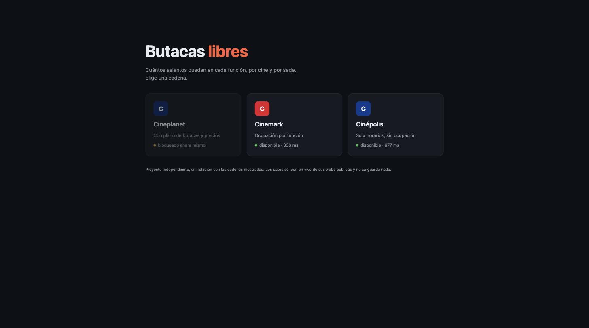
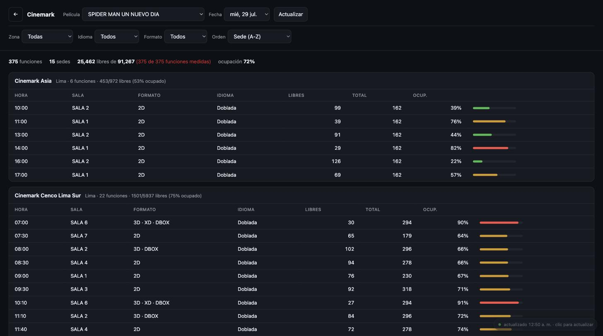
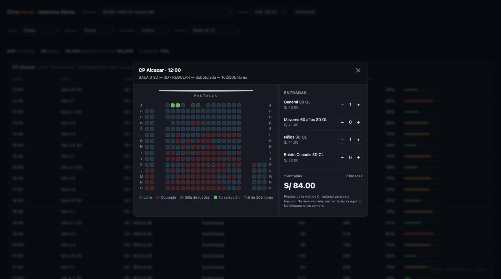

<p align="center">
  
</p>

<p align="center">
  <b>Cuántos asientos quedan en cada función de cine, por sede y por película.</b><br>
  <sub>Lee en vivo las webs públicas de las cadenas peruanas. No guarda nada. Sin dependencias.</sub>
</p>

<p align="center">
  
  
  
  
</p>

---

## Qué hace

Eliges una cadena y una película, y ves **cuántas butacas quedan libres en cada función**, agrupadas por sede, con su porcentaje de ocupación. Sirve para saber si esa función de las 7 ya está llena antes de salir de casa, o para encontrar la sala con más sitio.

```
CP Alcazar          Lima · 20 funciones · 1993/4456 libres (55% ocupado)
─────────────────────────────────────────────────────────────────────────
HORA    SALA        FORMATO       IDIOMA        LIBRES  TOTAL  OCUP.
12:00   SALA 6 3D   3D · REGULAR  Subtitulada      164    265   38%  ▓▓▓░░░░░
12:30   SALA 1      2D · REGULAR  Subtitulada       43    208   79%  ▓▓▓▓▓▓░░
18:30   SALA 1      2D · REGULAR  Subtitulada       40    208   81%  ▓▓▓▓▓▓▓░
```

En Cineplanet, además, cada función abre un **plano de butacas real** con una calculadora de precios en vivo.

## Arranque

```bash
git clone https://github.com/anthoniriv/butacas-libres.git
cd butacas-libres
node server.js
```

Abre <http://localhost:3000>. No hay `npm install`: cero dependencias, solo Node 18+ por el `fetch` nativo.

```bash
PORT=4173 node server.js   # otro puerto
```

## Cadenas

|  | Cineplanet | Cinemark | Cinépolis |
|---|:---:|:---:|:---:|
| **Ocupación** | ✅ por función | ✅ en la parrilla | ❌ no la publica |
| **Plano de butacas** | ✅ | — | — |
| **Precios** | ✅ | — | — |
| **Coste por película** | ~925 peticiones | ~15 | 1 |
| **Espera entre refrescos** | 120 s | 60 s | 300 s |

Cada cadena declara sus capacidades y el front se reconfigura solo: Cineplanet carga la ocupación **por sede al abrirla**, Cinemark la trae toda de una, y en Cinépolis se ocultan las columnas de asientos.

> **Cinépolis va sin ocupación a propósito.** Su cartelera es pública, pero los asientos viven tras Cloudflare y un token de reCAPTCHA Enterprise. Son medidas anti-bot deliberadas y este proyecto no las sortea.

## Cómo se comporta

Este proyecto lee infraestructura ajena, así que está construido para pesar poco:

- **Nada automático.** No hay refresco en segundo plano ni temporizadores que pidan datos. Solo se consulta cuando haces algo: abrir la app, pulsar Actualizar, abrir una sede o una función.
- **Espera obligatoria** entre refrescos, distinta por cadena según lo que cuesta cada una. Los clics de más se descartan, no se encolan.
- **Una sola cola de salida** por cadena, con límite de peticiones por segundo. Abrir cinco sedes no multiplica la concurrencia: solo alarga la cola.
- **Cancelación real.** Cerrar una sede o cambiar de película aborta lo pendiente, y la cola lo descarta *antes* de gastar la petición.
- **Bloqueos con enfriamiento.** Si una cadena corta el acceso, se detecta, se para en seco y se avisa con el tiempo de espera — sin insistir y alargar el castigo.

| Acción | Peticiones al origen |
|---|---|
| Abrir la app | 3 (catálogo; luego cacheado 10 min) |
| Cambiar película, fecha o filtros | 0 |
| Abrir una sede | ~20 (Cineplanet) · 0 (resto) |
| Abrir una función | 2 |

## Capturas

<p align="center">
  <br>
  <sub>Cada tarjeta comprueba si su cadena responde. Aquí Cineplanet estaba bloqueando peticiones.</sub>
</p>

<p align="center">
  <br>
  <sub>375 funciones en 15 sedes, con su ocupación y filtros por zona, idioma y formato.</sub>
</p>

<p align="center">
  <br>
  <sub>En Cineplanet, cada función abre su plano real y calcula el total según los tipos de entrada.</sub>
</p>

## Estructura

```
lib/net.js          cola, límite de tasa, reintentos, detección de bloqueo
providers/          una cadena por archivo, misma interfaz
  ├── cineplanet.js
  ├── cinemark.js
  ├── cinepolis.js
  └── index.js      registro
server.js           HTTP sin framework
public/index.html   todo el front en un archivo
```

### Añadir una cadena

Un módulo en `providers/` que exporte `id`, `name`, `color`, `capabilities`, `refreshWait`, `moviesList()`, `availability()`, `seatsFew()` y `health()`, y listarlo en `providers/index.js`. La capa de red le da cola, límite de tasa y detección de bloqueo propios: si una cadena cae, las demás siguen.

## API

Todas las rutas aceptan `?chain=cineplanet|cinemark|cinepolis`.

| Ruta | Devuelve |
|---|---|
| `GET /api/chains` | cadenas y sus capacidades |
| `GET /api/health` | quién responde y quién está bloqueado |
| `GET /api/movies` | cartelera |
| `GET /api/availability?movie=<slug>&date=YYYY-MM-DD` | funciones de esa película |
| `GET /api/seats?ids=<id>,<id>` | ocupación de un lote de funciones |
| `GET /api/seatplan?session=<cinemaId>-<sessionId>` | plano de butacas |
| `GET /api/tickets?session=<cinemaId>-<sessionId>` | entradas y precios |
| `GET /api/stats` | estado de las colas de salida |

## Ajustes

| Variable | Defecto | Qué hace |
|---|---|---|
| `PORT` | `3000` | puerto |
| `RPS` | `6` | peticiones por segundo hacia cada origen |
| `CONCURRENCY` | `6` | peticiones en paralelo |
| `SEAT_TTL_MS` | `45000` | caché de ocupación |
| `DETAIL_TTL_MS` | `30000` | caché de plano y precios |
| `CINEPLANET_REFRESH_WAIT` | `120` | espera entre refrescos (s) |
| `CINEMARK_REFRESH_WAIT` | `60` | ídem |
| `CINEPOLIS_REFRESH_WAIT` | `300` | ídem |

## Cómo funcionan las APIs por dentro

El detalle de los endpoints de cada cadena, los formatos de respuesta y los obstáculos encontrados (cookies, cabeceras obligatorias, códigos de estado de butaca) está en **[docs/apis.md](docs/apis.md)**.

## Aviso

Proyecto independiente y sin ánimo de lucro, **sin relación ni respaldo de Cineplanet, Cinemark o Cinépolis**. Las marcas pertenecen a sus dueños.

Los datos se leen en vivo de sus webs públicas y no se almacenan. Esta herramienta **no reserva ni compra nada**: marcar butacas en el plano no las bloquea. Los precios son informativos; los oficiales son los de cada cadena.

Está pensada para correr **en local**, para tu propio uso. Si la despliegas como servicio público, todo el tráfico saldrá de una sola IP compartida entre tus usuarios, y las cadenas pueden bloquearla — como ya pasó durante el desarrollo.

## Contribuir

Las ramas `main` y `develop` están protegidas: todo entra por pull request contra `develop`. El flujo completo está en [CONTRIBUTING.md](CONTRIBUTING.md).

## Licencia

[MIT](LICENSE) · [@anthoniriv](https://github.com/anthoniriv)
